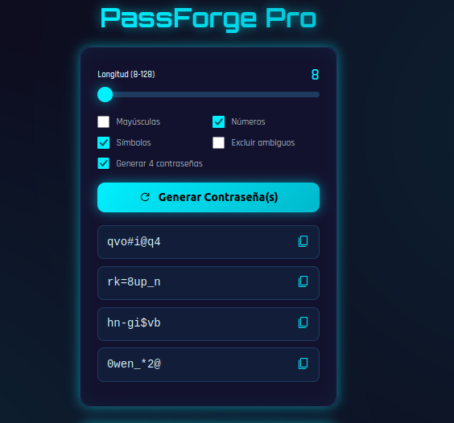
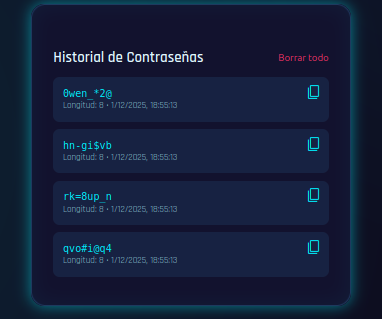

# PassForge Pro – Generador de Contraseñas Ultra Seguro (Cyberpunk Edition)  🔒

**Proyecto Final – Aplicación web 100% funcional con diseño profesional**  
**Generador de Contraseñas – Opción 2 (elegida por su simplicidad, seguridad y alto impacto visual)**  

**Enlace en vivo →** https://cgz-source.github.io/PassForge-Pro/ 

---

### 💻 Herramientas de IA utilizadas 

| Herramienta          | Uso real en el proyecto                                                                                 | Evidencia en el código / resultado final                                      |
|----------------------|----------------------------------------------------------------------------------------------------------|-------------------------------------------------------------------------------|
| **Google Stitch**    | Generación inicial del diseño base y estructura visual (colores, tarjetas, sliders, botones)            | Diseño original exportado y luego mejorado manualmente con estilo cyberpunk  |
| **Nerd.lat**         | Exploración profunda para generar lógica avanzada de generación segura y medidor de fuerza             | Inspiración directa en la lógica final (aunque se reimplementó en JS vainilla por compatibilidad) |
| **Magic Loops**      | Generación de snippets para manejo de localStorage, historial persistente y copiado al portapapeles   | Funcionalidades de historial y copiar con feedback visual                     |

> **Nota importante:** Se priorizó la máxima compatibilidad y rendimiento utilizando **JavaScript vainilla + CSS puro** (sin frameworks ni dependencias externas), logrando así una aplicación instantánea, segura y desplegable en cualquier servidor estático.

---

### ⚙️ Características implementadas 

- Generación de contraseñas ultra seguras (8–128 caracteres)  
- Opciones completas: mayúsculas, números, símbolos, excluir caracteres ambiguos (I l 1 O 0)  
- Opción de generar 1 o 4 contraseñas simultáneamente  
- Medidor visual de longitud en tiempo real  
- Copiado al portapapeles con feedback visual instantáneo (ícono cambia a check)  
- Historial persistente con localStorage (máximo 20 entradas)  
- Información detallada en historial: contraseña, longitud y fecha/hora  
- Botón para borrar todo el historial  
- Diseño cyberpunk totalmente personalizado con CSS puro (sin Tailwind ni frameworks)  
- Totalmente responsive y optimizado para móvil y escritorio  
- 100% offline – funciona sin internet después de la primera carga  
- Zero dependencias externas (excepto fuentes de Google)  

---

### 🔧 Tecnologías utilizadas 

- **HTML5** – Estructura semántica  
- **CSS3 puro** – Estilo cyberpunk con variables, gradientes, glow y animaciones  
- **JavaScript vainilla (ES6+)** – Toda la lógica (sin React, sin librerías)  
- **localStorage** – Persistencia de datos  
- **Clipboard API** – Copiado moderno al portapapeles  
- **Google Fonts** – Tipografías Orbitron + Rajdhani (estética cyberpunk)  
- **Material Symbols** – Iconos modernos  

---

### 📷 Capturas de pantalla 

### *Interfaz principal con estilo cyberpunk neon*

 

### *Historial persistente y feedback visual al copiar*

